# *IsoNet2* Tutorial

*IsoNet2* is a deep-learning software package for simultaneous missing wedge correction, denoising, and CTF correction in cryo-electron tomography reconstructions using a deep neural network trained on information from the original tomogram(s). Compared to IsoNet1, *IsoNet2* produces tomograms with higher resolution and less noise in roughly a tenth of the time. The software requires full tomograms or even/odd paired tomograms as input. Paired tomograms for Noise2Noise training can be split by either frame or tilt.

*IsoNet2* contains six modules: ***prepare_star***, ***deconv***, ***make_mask***, ***denoise***, ***refine***, and ***predict***. All commands in IsoNet operate on `.star` text files which record paths of data and relevant parameters. For detailed descriptions of each module please refer to the individual tasks. Users can choose to utilize IsoNet through either GUI or command-lines.

# 1. Installation and System Requirements
The following tutorial is written assuming absolutely no experience with Anaconda or Linux environments.

## Installing [Conda](https://docs.conda.io/projects/conda/en/latest/user-guide/getting-started.html)
+ Download your `conda-installer`:

  + [Miniconda](https://www.anaconda.com/docs/getting-started/miniconda/main) installer for Linux (use this if you're new).

  + [Anaconda Distribution](https://www.anaconda.com/download) installer for Linux.

  + [Miniforge](https://conda-forge.org/download/) installer for Linux.

+ Verify your installer [hashes](https://docs.conda.io/projects/conda/en/latest/user-guide/install/index.html#hash-verification).

+ In your terminal window, run `bash <conda-installer>-latest-Linux-x86_64.sh`

+ Follow the prompts on the installer screens. If you are unsure about any setting, accept the defaults. You can change them later.

+ Close and then re-open your terminal window.

+ After successful installation, running the command conda list should display a list of installed packages.

## Installing [CUDA](https://docs.nvidia.com/cuda/cuda-installation-guide-linux/index.html)
+ Find information on your GPU for [Linux](https://itsfoss.com/check-graphics-card-linux/).

+ Look up your GPU to make sure it is supported. If its [CUDA GPU Compute Capability](https://developer.nvidia.com/cuda-gpus) is below ***3.5***, you will not be able to run IsoNet2.

+ Reference your Toolkit Driver Version in *Table 3* on the [CUDA Toolkit Docs.](https://docs.nvidia.com/cuda/cuda-toolkit-release-notes/index.html#cuda-major-component-versions__table-cuda-toolkit-driver-versions) to see that it has a corresponding CUDA Version >= 11.8 *(Toolkit Driver Version >=520.61.05)*.

+ Make sure you have installed the sufficient graphics card driver version for your GPU from the [NVIDIA driver page](https://www.nvidia.com/en-us/drivers/).

+ Select the [CUDA Toolkit](https://developer.nvidia.com/cuda-toolkit-archive) version that matches what you read in *Table 3* and follow the install instructions.

After successfully installing, you can check your CUDA version using `nvidia-smi`, which should produce something similar to below:
```
+---------------------------------------------------------------------------------------+
| NVIDIA-SMI 535.129.03             Driver Version: 535.129.03   CUDA Version: 12.2     |
|-----------------------------------------+----------------------+----------------------+
| GPU  Name                 Persistence-M | Bus-Id        Disp.A | Volatile Uncorr. ECC |
| Fan  Temp   Perf          Pwr:Usage/Cap |         Memory-Usage | GPU-Util  Compute M. |
|                                         |                      |               MIG M. |
|=========================================+======================+======================|
|   0  NVIDIA A100 80GB PCIe          Off | 00000000:01:00.0 Off |                    0 |
| N/A   34C    P0              41W / 300W |     18MiB / 81920MiB |      0%      Default |
|                                         |                      |             Disabled |
+-----------------------------------------+----------------------+----------------------+
|   1  NVIDIA A100 80GB PCIe          Off | 00000000:25:00.0 Off |                    0 |
| N/A   36C    P0              46W / 300W |     18MiB / 81920MiB |      0%      Default |
|                                         |                      |             Disabled |
+-----------------------------------------+----------------------+----------------------+
|   2  NVIDIA A100 80GB PCIe          Off | 00000000:81:00.0 Off |                    0 |
| N/A   35C    P0              46W / 300W |     18MiB / 81920MiB |      0%      Default |
|                                         |                      |             Disabled |
+-----------------------------------------+----------------------+----------------------+
|   3  NVIDIA A100 80GB PCIe          Off | 00000000:C1:00.0 Off |                    0 |
| N/A   37C    P0              46W / 300W |     18MiB / 81920MiB |      0%      Default |
|                                         |                      |             Disabled |
+-----------------------------------------+----------------------+----------------------+

+---------------------------------------------------------------------------------------+
| Processes:                                                                            |
|  GPU   GI   CI        PID   Type   Process name                            GPU Memory |
|        ID   ID                                                             Usage      |
|=======================================================================================|
|    0   N/A  N/A      3610      G   /usr/lib/xorg/Xorg                            4MiB |
|    1   N/A  N/A      3610      G   /usr/lib/xorg/Xorg                            4MiB |
|    2   N/A  N/A      3610      G   /usr/lib/xorg/Xorg                            4MiB |
|    3   N/A  N/A      3610      G   /usr/lib/xorg/Xorg                            4MiB |
+---------------------------------------------------------------------------------------+

```
## Installing IsoNet2

### GUI Installation
Download the *IsoNet2* release from the release tab on the right column of our [Github](https://github.com/procyontao/IsoNet2) repository. This release contains the binary file for the GUI. Extract the compressed file into your desired installation folder. 

### non-GUI Installation
Alternatively, if you only plan to use our command-line interface (CLI), you can clone this repository by running `git clone https://github.com/procyontao/IsoNet2.git` in your desired installation folder. This will not contain the compiled GUI file. 

Once you have installed IsoNet2, navigate to your installation folder and run `cd IsoNet2` and `bash install.sh`. This creates an Conda environment (installing requirements) using the included `isonet2_environment.yml` file and updates your environment variables (allowing you to call isonet.py) by running `source isonet2.bashrc`. You may append this command to your .bashrc file so you don't have to re-source it every time you wish to use IsoNet.


Installation should take 5-10 minutes. Upon successful installation, running the command `isonet.py --help` should display the following help message.
```
INFO: Showing help with the command 'isonet.py -- --help'.

NAME
    isonet.py - ISONET: Train on tomograms to simultaneously perform missing wedge correction, CTF correction, and denoising.

...
```
# 2. Tutorial

The following tutorial outlines the basic *IsoNet2* workflow on 5 immature HIV-1 dMACANC VLP even/odd paired tomograms using the GUI and CLI.

In-depth explanations for every parameter can be found under **3. IsoNet Modules.** The tutorial dataset, along with a video tutorial, can be found in the following [Box](https://ucla.box.com/v/isonet2tutorial) drive.


**Fig. 1.** XZ slices and corresponding Fourier space of HIV tomograms 1) reconstructed with weighted back projection 2) CTF-deconvolved 3) CTF-corrected and denoised 4) CTF-corrected, denoised, and missing-wedge corrected.

## 2.0 Download Tomograms

In a new working directory, download and extract the `tomograms_split` folder from the link above.


**Fig. 2.** XY slices of even HIV tomograms reconstructed with weighted back projection.

## 2.1 GUI

The *IsoNet2* GUI provides intuitive, detailed, and organized process management. The interface provides tools for dataset organization, parameter configuration, job submission, and real-time process monitoring. Entry points for the main processing steps are kept in a left-hand menu, while the central panel shows the program’s live output during a run, allowing users to view refinement in real time and make adjustments as needed.

### 2.1.0 Launch GUI
Launch the GUI by typing `IsoNet2` in your terminal. Some machines may have issues with the SUID sandbox. If you encounter this, run `IsoNet2 -no-sandbox` instead.

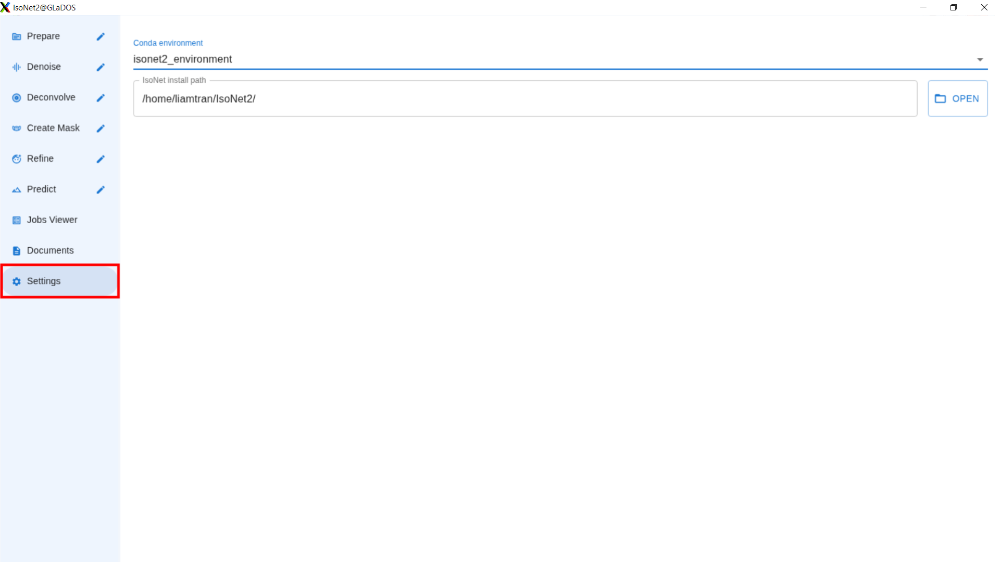
Once the GUI opens, select the ***Settings*** Tab to select your **conda environment** and **IsoNet Install Path**. These are saved to your `~/.config/isoapp/environment.json` and will be remembered every time you open the GUI.

### 2.1.1 Prepare Star

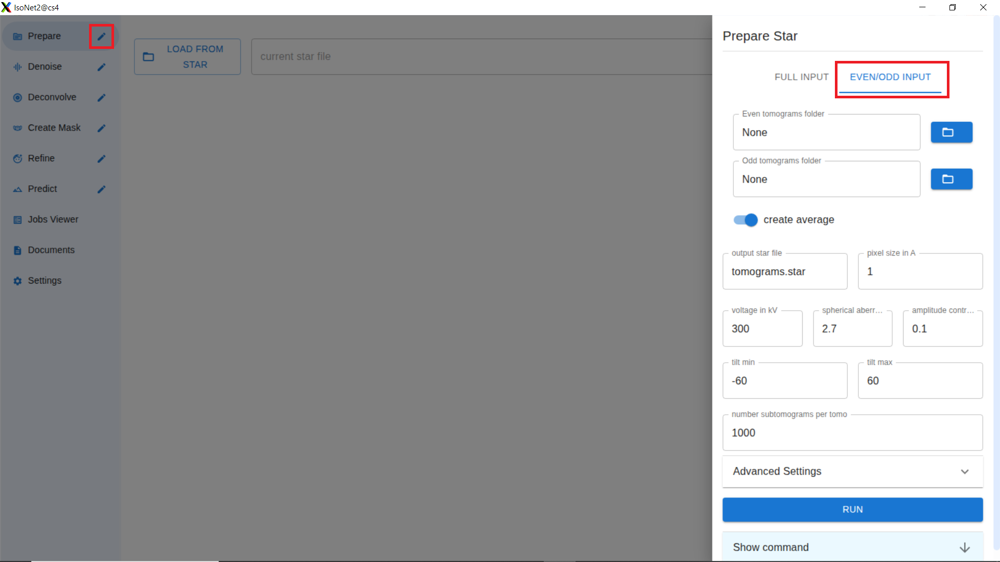
Open the ***Prepare*** tab and select **Even/Odd Input**.

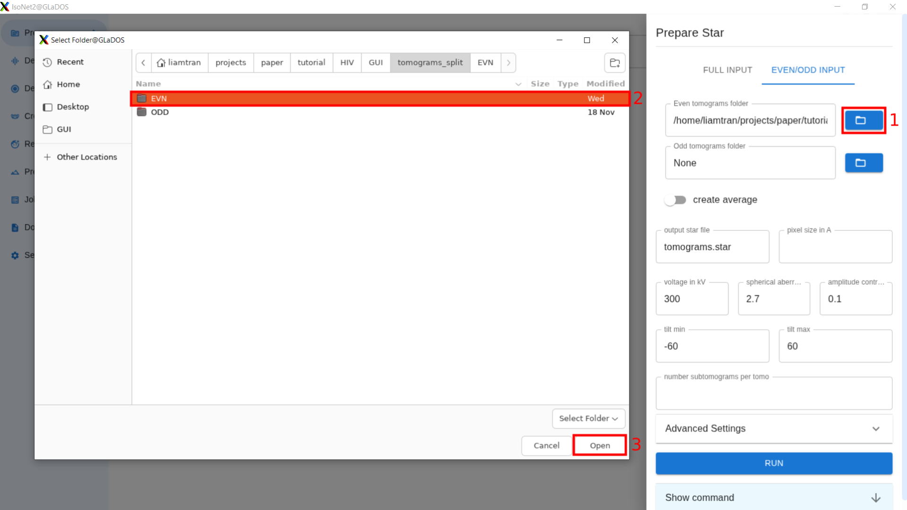
Select your **even** dataset in the popup directory. Do the same for your **odd** dataset.

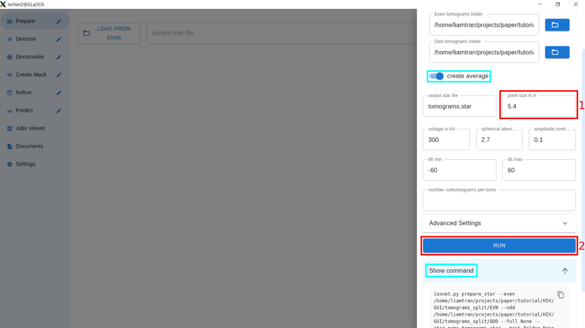
Set your **pixel size in Å** to 5.4 and leave the other parameters at their default values. Then select **Run**.
 
You may optionally enable **create_average** to average the half tomograms and reduce noise for the ***Deconvolve*** and ***Create Mask*** modules (more information in **Section 2.1.2: Pre-Mask Processing**). 
For each module, **Show command** provides the `isonet.py` command if you prefer to run it directly in your terminal.

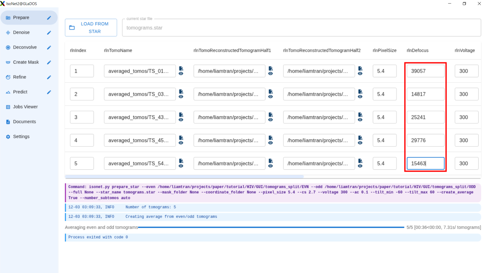
The starfile should automatically display. If you ran the command in your terminal, or if you have a pre-existing RELION5 starfile, select **Load from Star** and choose the starfile from your working directory. Fill in the **rlnDefocus** column with the approximate defocus in Å at 0° tilt for each tomogram.

### 2.1.2 Pre-Mask Processing

*The following options apply CTF correction to improve the signal-to-noise ratio before generating a mask for refinement.*

### 2.1.2a Denoise
If you have access to even/odd paired tomograms, as we do in this tutorial, we recommend using the **Denoise** module. This provides comparable results to running a full **Refine** job and using the corrected tomograms to generate the mask, as in the *IsoNet2* paper.

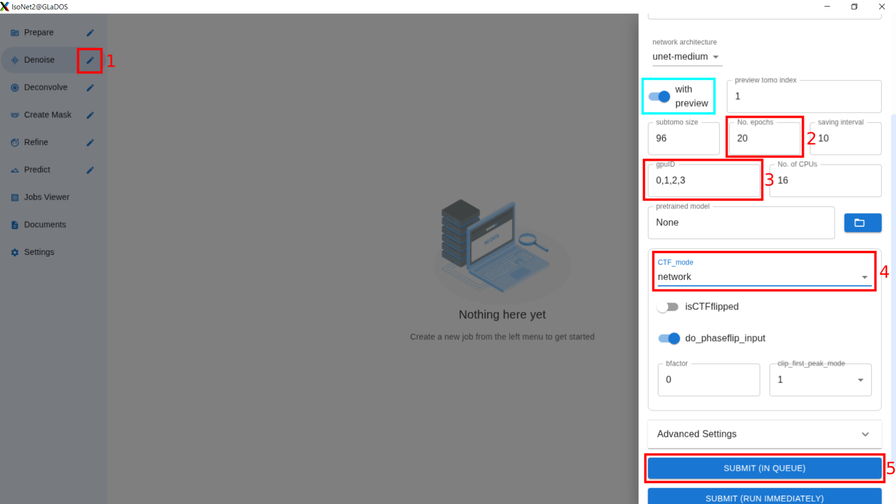
Open the ***Denoise*** tab. Set **No. epochs** to 20, define the appropriate **gpuIDs** and select **CTF_mode** network from the popup menu. Click **Submit (In Queue)**.

>**with preview** enables us to view live predictions from the network.

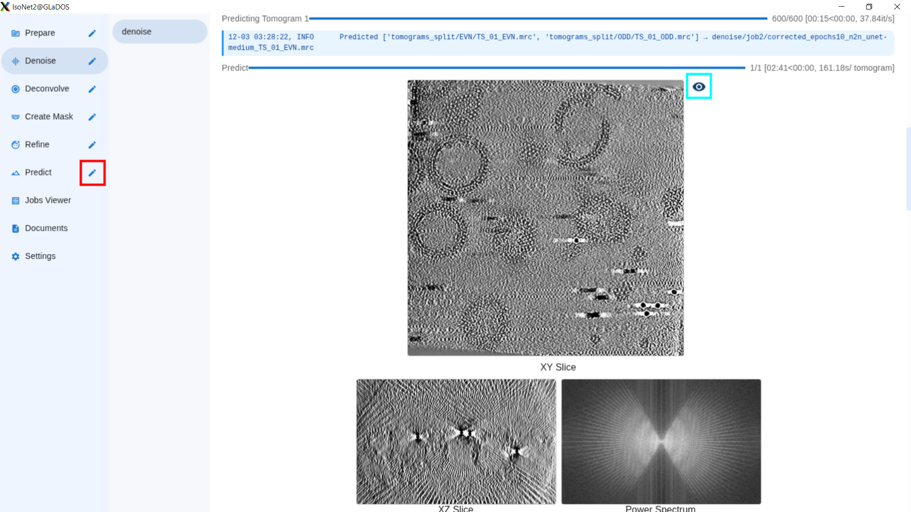
The page should automatically load your progress as the network begins training. The log output `log.txt` and a graph of the loss `loss_full.png` will be saved to `./denoise/<jobID>/`, along with all model files. With **with preview** enabled, the network also saves and displays a prediction for the selected tomograms (via **preview tomo index**) after every **saving interval** (default 10 epochs). 

>Clicking on the eye icon next to our preview will open the denoised tomogram file in IMOD.

Before this job finishes, let's practice queuing jobs. Open the ***Predict*** tab.

### 2.1.2b Predict

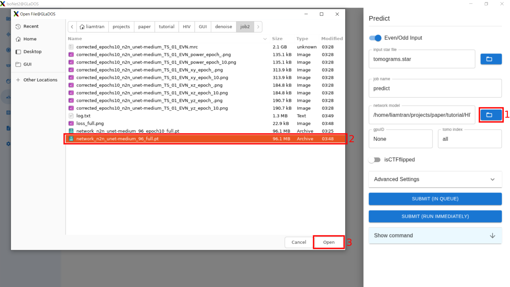
Select the completed model file `network_<method>_<arch>_<cube_size>_full.pt` from the current running job's directory. This handle will always point to the newest version, meaning we can select it now and ***Predict*** will run using the fully trained model once training is completed.

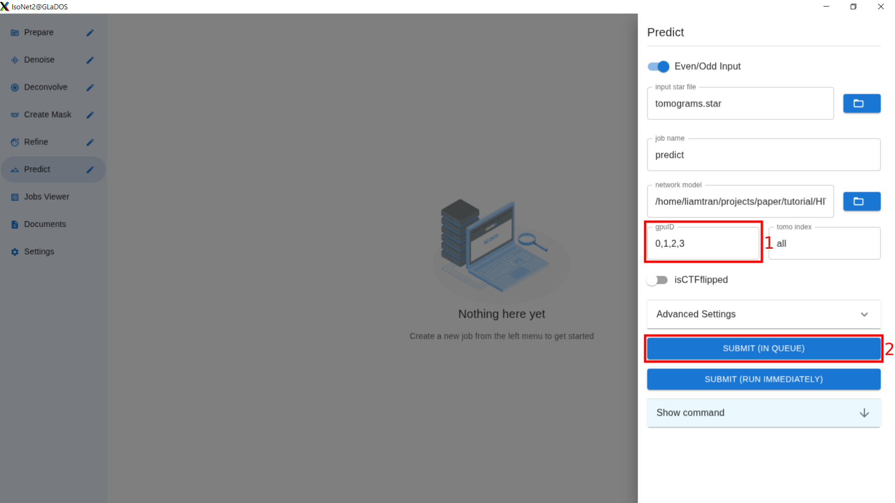
Define the appropriate **gpuIDs** and click **Submit (In Queue)**.

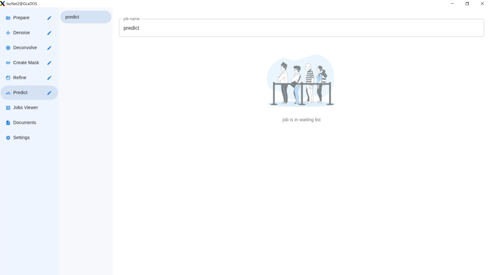
A waiting screen should automatically display. This will be displayed any time you are viewing a job in queue.

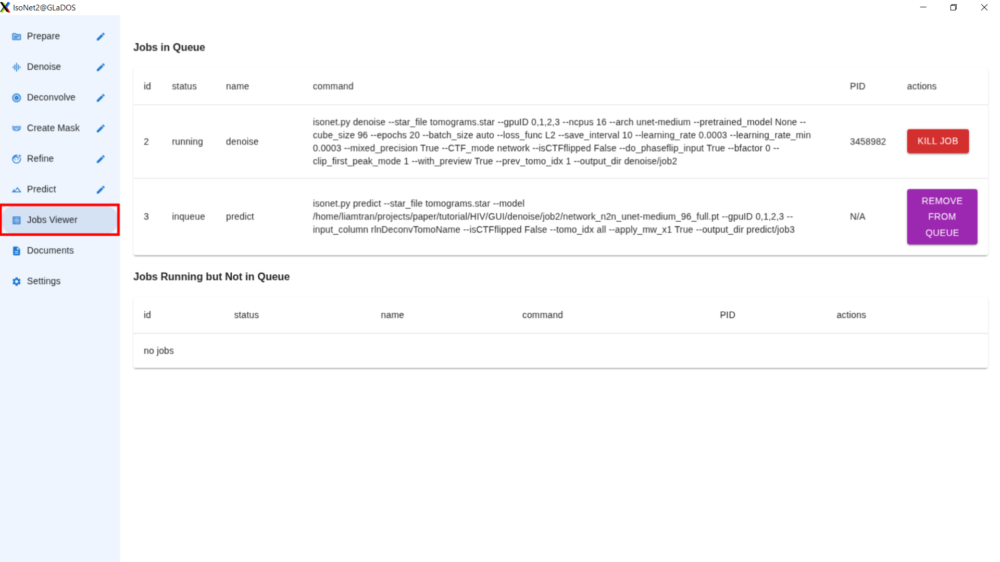
Open the ***Jobs Viewer*** tab. Here, you can manage all your submitted jobs. Jobs that are submitted to run immediately on any of the other pages will bypass the queue and run simultaneously with any current jobs.

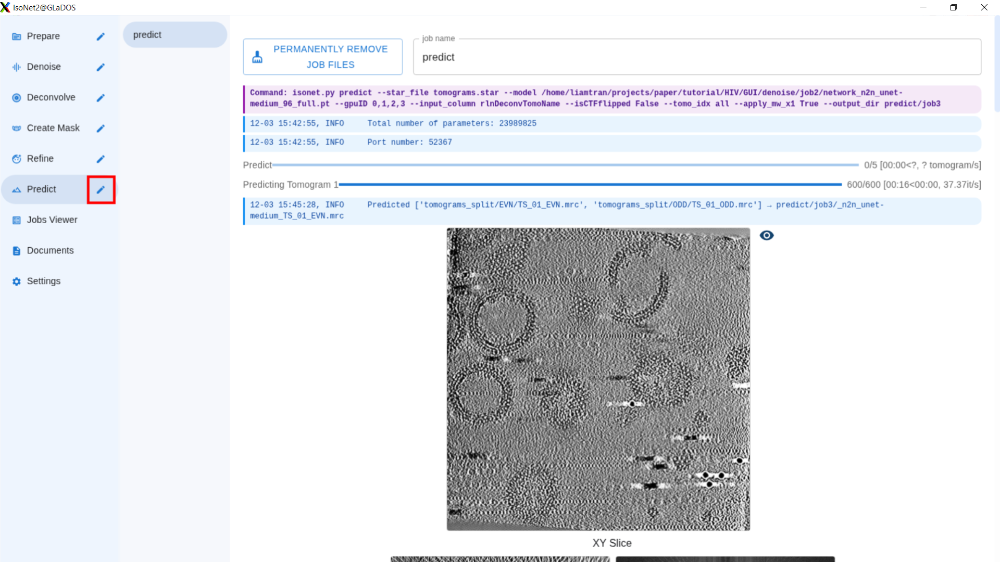
Once our previous job finishes, we can open the ***Predict*** tab again and view the live network outputs for all our tomograms.

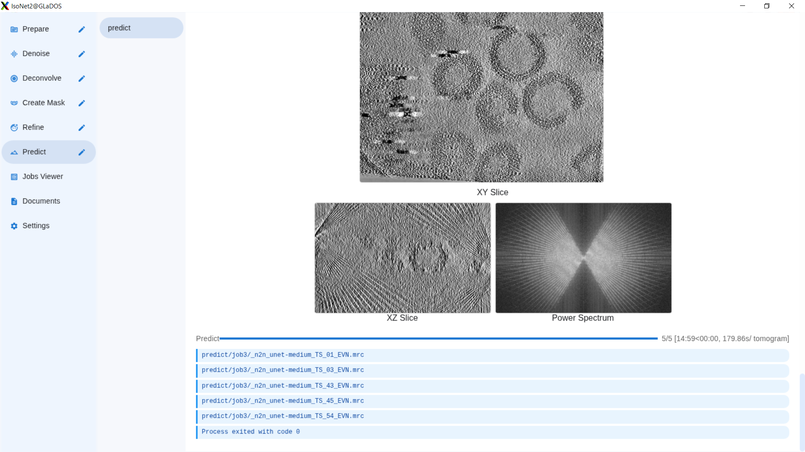
Wait for prediction to finish. Once done, you can view your corrected tomograms at the provided paths.

### 2.1.2c Deconvolve
If you are unable to use the network-based CTF correction in the ***Denoise*** module, you can instead use the ***Deconvolve*** module, inherited from *IsoNet1*, to improve mask quality. While this is relatively quick, it may produce lower quality masks than using ***Denoise***.

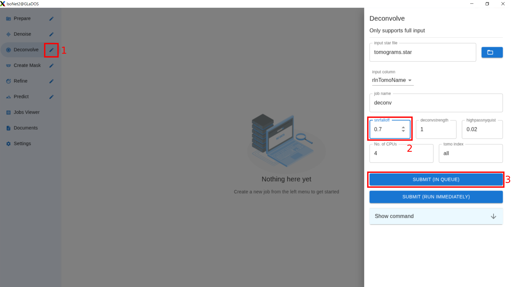
Open the ***Deconvolve*** tab and set **snrfalloff** to 0.7. Click **Submit (In Queue)**.

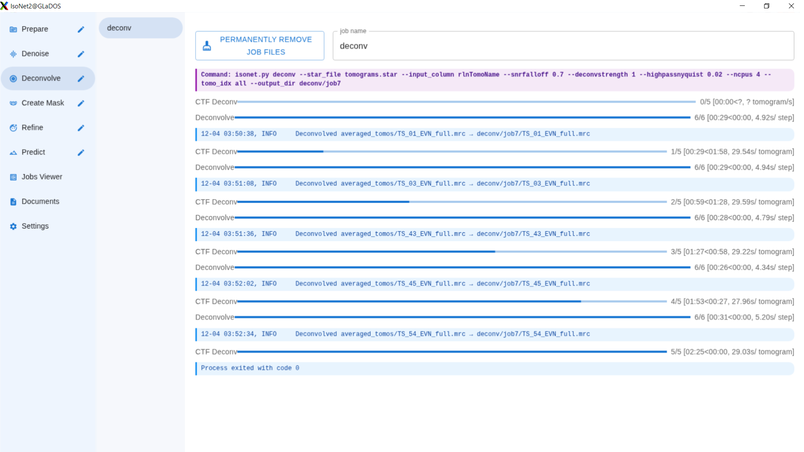
The page should automatically load your progress as the network begins training. The log output `log.txt` will be saved to `./deconv/<jobID>/`, along with all deconvolved tomograms.

### 2.1.3 Create Mask
This step creates masks based on standard deviation and mean density to exclude empty/unwanted areas of each tomogram. During extraction, each subtomogram for training is centered on a valid region of the mask to ensure that it captures a region of interest.

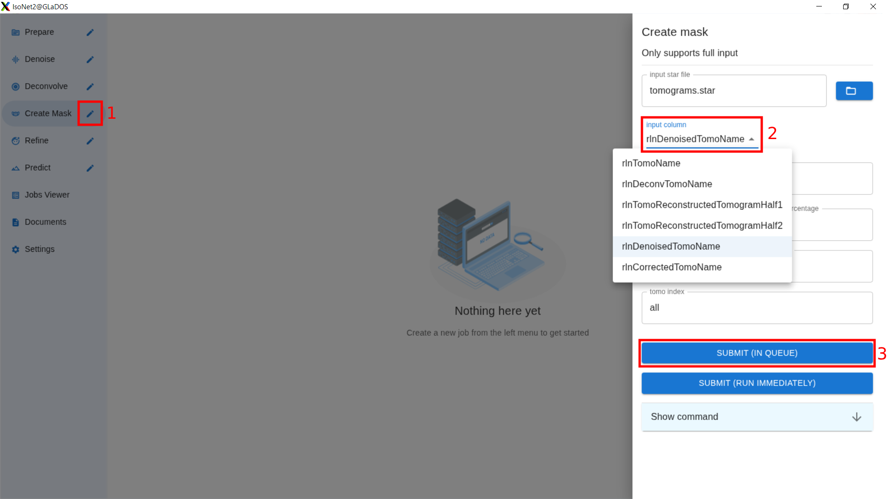
Open the ***Create Mask*** tab and select your **Input Column**:
1) **rlnDenoisedTomoName** if you used the ***Denoise*** module.
2) **rlnDeconvTomoName** if you used the ***Deconvolve*** module.
3) **rlnCorrectedTomoName** if you are refining a previously refined dataset.
>Using the other unprocessed input columns will likely generate poor masks, and is not recommended.

**Submit** your job.

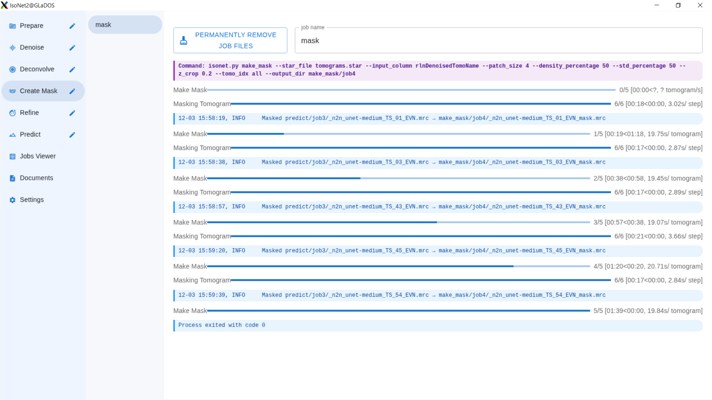
The page should automatically load your progress as the network begins training. The log output `log.txt` will be saved to `./mask/<jobID>/`, along with all masked tomograms.


**Fig. 3.** XY slices and corresponding masks of HIV tomograms that have been 1) reconstructed with weighted back projection, 2) CTF-deconvolved, 3) CTF-corrected and denoised

### 2.1.4 Refine

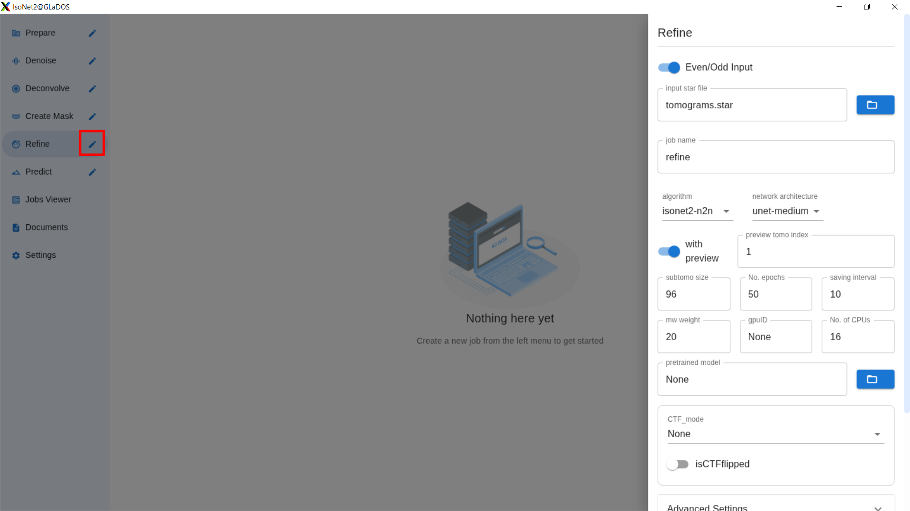
Open the ***Refine*** tab. Keep **Even/Odd Input** enabled.


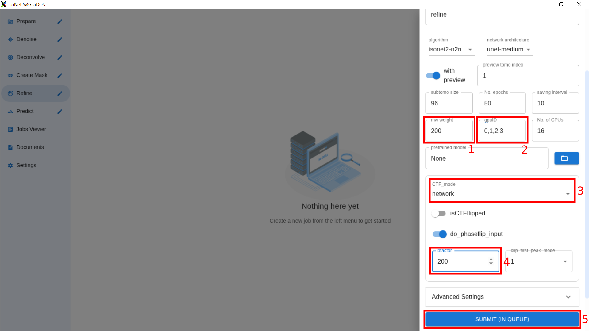
 Set **mw weight** to 200, define the appropriate **gpuIDs**, select **CTF_mode** network from the popup menu, and set **bfactor** to 200. Click **Submit (In Queue)**.
 

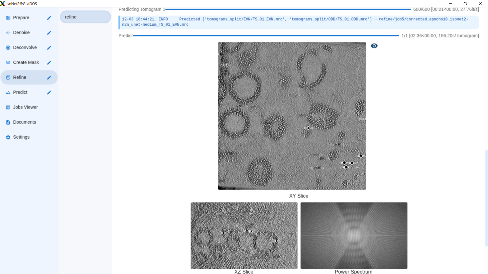
The page should automatically load your progress as the network begins training. The log output, `log.txt`, a graph of the loss, `loss_full.png`, and all model files will be saved to `./refine/<jobID>/`. With **with preview** enabled, the network also saves and displays a prediction for the first tomogram after every **saving interval** (default: 10 epochs). 

Refer to the Predict instructions under **Section 2.1.2b Predict** to queue a predict job once your refinement finishes. Once prediction is done, view your CTF-corrected, denoised, and missing-wedge-corrected tomograms!


**Fig. 4.** XY slices of HIV tomograms CTF-corrected, denoised, and missing-wedge corrected using *IsoNet2* Refine.

## 2.2 Command Line

Once you are familiar with the *IsoNet2* workflow, you may prefer the CLI for more hands-on data management and in-depth fine-tuning of different hyperparameters. This tutorial follows through the exact same workflow as above; alternatively to following this, you could paste the output from **Show command** for each module into the terminal and achieve the same result.

### 2.2.1 prepare_star
Run the following command to prepare the starfile. You may enter a single `defocus` value (to be used for every tomogram) or a comma-separated list of values (to be applied to their respective tomograms). You may also leave it as None and use your default text editor or the GUI to open `tomograms.star` and manually enter the defocus values. We will optionally set `--create_average` as True to show how tomogram processing would work without even/odd paired tomograms
```
isonet.py prepare_star --even tomograms_split/EVN --odd tomograms_split/ODD --create_average True --pixel_size 5.4 --defocus "[39057,14817,25241,29776,15463]"
```

Output for `cat tomograms.star`:

```
# Created by the starfile Python package (version 0.5.6) at 15:09:27 on 26/11/2025


data_

loop_
_rlnIndex #1
_rlnTomoName #2
_rlnTomoReconstructedTomogramHalf1 #3
_rlnTomoReconstructedTomogramHalf2 #4
_rlnPixelSize #5
_rlnDefocus #6
_rlnVoltage #7
_rlnSphericalAberration #8
_rlnAmplitudeContrast #9
_rlnMaskBoundary #10
_rlnMaskName #11
_rlnTiltMin #12
_rlnTiltMax #13
_rlnBoxFile #14
_rlnNumberSubtomo #15
_rlnCorrectedTomoName #16
1       averaged_tomos/TS_01_EVN_full.mrc       tomograms_split/EVN/TS_01_EVN.mrc       tomograms_split/ODD/TS_01_ODD.mrc       5.400000        39057   300     2.700000        0.100000        None    None -60      60      None    600.000000      None
2       averaged_tomos/TS_03_EVN_full.mrc       tomograms_split/EVN/TS_03_EVN.mrc       tomograms_split/ODD/TS_03_ODD.mrc       5.400000        14817   300     2.700000        0.100000        None    None -60      60      None    600.000000      None
3       averaged_tomos/TS_43_EVN_full.mrc       tomograms_split/EVN/TS_43_EVN.mrc       tomograms_split/ODD/TS_43_ODD.mrc       5.400000        25241   300     2.700000        0.100000        None    None -60      60      None    600.000000      None
4       averaged_tomos/TS_45_EVN_full.mrc       tomograms_split/EVN/TS_45_EVN.mrc       tomograms_split/ODD/TS_45_ODD.mrc       5.400000        29776   300     2.700000        0.100000        None    None -60      60      None    600.000000      None
5       averaged_tomos/TS_54_EVN_full.mrc       tomograms_split/EVN/TS_54_EVN.mrc       tomograms_split/ODD/TS_54_ODD.mrc       5.400000        15463   300     2.700000        0.100000        None    None -60      60      None    600.000000      None
```

### 2.2.2a denoise
If you have access to even/odd paired tomograms, as we do in this tutorial, we recommend using `denoise` before generating masks. This increases SNR, providing comparable results to running `refine` and using the corrected tomograms to generate the mask as done in the *IsoNet2* paper. `--epochs 20` should be sufficient for making masks. `--CTF_mode network` multiplies the network input with the CTF, analogous to missing wedge mask application. 
```
isonet.py denoise tomograms.star --epochs 20 --CTF_mode network --gpuID <ids>
```

### 2.2.2b predict
After training, apply the trained model to all of the original tomograms to denoise and correct for CTF.
```
isonet.py predict tomograms.star denoise/network_n2n_unet-medium_96_full.pt --gpuID <ids>
```

### 2.2.2c deconv
If you are unable to use the network-based CTF correction in ***denoise***, you may instead use ***deconv*** to improve mask quality. This functionality is inherited from *IsoNet1*. While it is quicker, it may produce lower quality masks than using ***denoise***. `--snrfalloff` reduces high-frequency contribution stabilizing deconvolution on noisy data. `--deconvstrength` multiplies correction and low-frequency recovery.
```
isonet.py deconv tomograms.star --snrfalloff 0.7 --deconvstrength 1
```

### 2.2.3 make_mask
Create masks based on standard deviation and mean density to exclude empty/unwanted areas of each tomogram. During extraction, each subtomogram for training is centered on a valid region of the mask to ensure that it captures a region of interest.
```
isonet.py make_mask tomograms.star --input_column <column>
```
For `--input_column`, use:
1) `rlnDenoisedTomoName` if you used ***denoise***.
2) `rlnDeconvTomoName` if you used ***deconv***.
3) `rlnCorrectedTomoName` if you are refining a previously refined dataset.
> Using the other unprocessed input columns will likely generate poor masks, and is not recommended.


**Fig. 3.** XY slices and corresponding masks of HIV tomograms that have been 1) reconstructed with weighted back projection, 2) CTF-deconvolved, 3) CTF-corrected and denoised

### 2.2.4 refine
Train the network to predict missing-wedge-corrected, CTF-corrected, and denoised tomograms. Enabling `--CTF_mode` network multiplies the network input with the CTF, analogous to missing wedge mask application. `--mw_weight` determines how heavily missing-wedge correction is prioritized over denoising: here the ratio is 200 to 1. `--bfactor` boosts high frequency information for CTF correction.
```
isonet.py refine tomograms.star --mw_weight 200 --bfactor 200 --CTF_mode network --gpuID <ids>
```

### 2.2.5 predict
After training, apply the trained model to all of the original tomograms to obtain CTF-corrected, denoised, and missing-wedge-corrected tomograms.
```
isonet.py predict tomograms.star isonet_maps/network_isonet2-n2n_unet-medium_96_full.pt --gpuID <ids>
```
Once prediction is done, view your CTF-corrected, denoised, and missing-wedge-corrected tomograms!


**Fig. 4.** XY slices of HIV tomograms CTF-corrected, denoised, and missing-wedge corrected using *IsoNet2* Refine.

# 3. *IsoNet2* Modules


## prepare_star
Generate a tomograms.star file in the same style as the RELION5 tomographic processing pipeline that lists tomogram file paths and acquisition metadata used by all downstream IsoNet commands.

### Key parameters
+ `full` — Directory with full tomogram files; use for single-map training (isonet2). Default: `"None"`.

+ `even` — Directory with even-half tomograms; use with odd for noise2noise (isonet2-n2n). Default: `"None"`.
+ `odd` — Directory with odd-half tomograms; use with even for noise2noise (isonet2-n2n). Default: `"None"`.
+ `ac` — Amplitude contrast. Default: **0.1**.
+ `coordinate_folder` — Optional directory with subtomogram coordinate files; if provided, the number of subtomograms is taken from the coordinate files and overrides number_subtomos. Default: `"None"`.
+ `create_average` — Creates full tomograms by summing the provided even and odd folders; useful for reducing noise for ***deconv*** and ***make_mask***. Default: `False`.
+ `cs` — Spherical aberration in mm. Default: **2.7**.
+ `defocus` — Defocus in Å at zero tilt. Can be a single value or list of values for each tomogram. Default: `[10000]`.
+ `mask_folder` — Optional directory with masks; entries are recorded in rlnMaskName. Default: `"None"`.
+ `number_subtomos` — Number of subtomograms to extract per tomogram (written to rlnNumberSubtomo). For *IsoNet2*, increasing this is analogous to increasing training exposure and can improve results at the cost of runtime and memory. Default: `"auto"` (3000 total per epoch divided by number of tomograms).
+ `pixel_size` — Pixel size in Å. By default, this is read from tomogram metadata. Override this if there is no metadata or if you have a different value. Default: `"auto"`.
+ `star_name` — Name of output starfile. Default: `"tomograms.star"`.
+ `tilt_max` — Maximum tilt angle in degrees. Default: **60**. Override if your tilt range is different.
+ `tilt_min` — Minimum tilt angle in degrees. Default: **-60**. Override if your tilt range is different.
+ `voltage` — Acceleration voltage in kV. Default: **300**.

### Practical notes
> This function accepts either a single set of full tomograms or paired even/odd half tomograms for noise2noise workflows. By default, **pixel size in Å** and **number of subtomograms per tomogram** are determined automatically from your tomograms' metadata. **tilt min/max** (default ±60) are used to define the shape of the missing wedge mask used during training. The other parameters are related to your physical electron microscope and are used later for CTF correction. Always inspect and edit the generated STAR if you need tomogram-specific subtomogram counts or have pregenerated mask/defocus entries.

## denoise
Entry point for *IsoNet2* training. Use denoise for quicker noise-to-noise (n2n) training workflows for preliminary tomogram testing and mask generation.

### Key parameters
+ `star_file` — STAR file for tomograms. Required parameter.

+ `arch` — Network architecture string (e.g., unet-small, unet-medium, unet-large). Determines model capacity and VRAM requirements. Default: `"unet-medium"`.
+ `batch_size` — Number of subtomograms per optimization step; if `"auto"`, this is automatically determined by multiplying the number of available GPUs by 2. If the number of GPUs is 1, batch size is 4. Batch size per GPU matters for gradient stability. Default: `"auto"`.
+ `bfactor` — B-factor applied during training/prediction to boost high-frequency content. For cellular tomograms we recommend a b-factor of 0. For isolated samples, you can use a b-factor from 200–300. Default: **0**.
+ `clip_first_peak_mode` — Controls attenuation of overrepresented very-low-frequency CTF peak. Options 2 and 3 might increase low-resolution contrast. Default: **1**.
  + 0 none
  + 1 constant clip
  + 2 negative sine
  + 3 cosine
+ `CTF_mode` — CTF handling mode: "None", "phase_only", "wiener", or "network". Default: `"None"`.
  + "None": No CTF correction
  + "phase_only": Phase-only correction
  + "network": Applies CTF-shaped filter to network input
  + "wiener": Applies Wiener filter to network target
+ `cube_size` — Size in voxels of training subvolumes. Must be compatible with the network (divisible by the network downsampling factors). This allows any multiple of 16 >= 64. Default: **96**.
+ `deconvstrength` — Scalar multiplier for deconvolution strength; increasing this emphasizes correction and low-frequency recovery. Default: **1.0**.
+ `do_phaseflip_input` — Whether to apply phase flip during training. Default: `True`.
+ `epochs` — Number of training epochs. Default: **50**.
+ `gpuID` — GPU IDs to use during training (e.g., "0,1,2,3"). Default: `None`.
+ `highpassnyquist` — Fraction of the Nyquist used as a very-low-frequency high-pass cutoff; use to remove large-scale intensity gradients and drift. Default: **0.02**.
+ `isCTFflipped` — Whether input tomograms are phase flipped. Default: `False`.
+ `learning_rate` — Initial learning rate. Default: **3e-4**.
+ `learning_rate_min` — Minimum learning rate for scheduler. Default: **3e-4**.
+ `loss_func` — Loss function to use (L2, Huber, L1). Default: `"L2"`.
+ `mixed_precision` — If True, uses float16/mixed precision to reduce VRAM and speed up training. Default: `True`.
+ `ncpus` — Number of CPUs to use for data processing. Default: **16**.
+ `output_dir` — Directory to save trained model and results. Default: `"denoise"`.
+ `prev_tomo_idx` — If set, automatically predict only the tomograms listed by these indices (e.g., "1,2,4" or "5-10,15,16"). Default: **1**.
+ `pretrained_model` — Path to pretrained model to continue training. Previous method, arch, cube_size, CTF_mode, and metrics will be loaded. Default: `None`.
+ `save_interval` — Interval to save model checkpoints. Default: **10**.
+ `snrfalloff` — Controls frequency-dependent SNR attenuation applied during deconvolution; larger values reduce high-frequency contribution more aggressively. Default: **0**.
+ `with_preview` — If True, run prediction using the final checkpoint(s) after training. Default: `True`.


Fig. 5. Effects of clip_first_peak_mode and bfactor on CTF.

### Practical notes
> Choose arch, cube_size, and batch_size to fit your GPU memory; larger architectures and cubes improve fidelity but increase resource needs.
Enable mixed_precision to save VRAM and speed up training if your GPU and drivers support it.


## deconv
CTF deconvolution preprocessing that enhances low-resolution contrast and recovers information attenuated by the microscope contrast transfer function. Recommended for non–phase-plate data; skip for phase-plate data or if intending to use network-based CTF deconvolution.

### Key parameters
+ `star_file` — Input STAR listing tomograms and acquisition metadata. Required parameter.

+ `chunk_size` — If set, tomograms are processed in smaller cubic chunks to reduce memory usage. Useful for very large tomograms or limited RAM/VRAM. May create edge artifacts if chunks are too small. Default: `None`.
+ `deconvstrength` — Scalar multiplier for deconvolution strength; increasing this emphasizes correction and low-frequency recovery but can introduce ringing/artifacts if set too high. Default: **1.0**.
+ `highpassnyquist` — Fraction of the Nyquist used as a very-low-frequency high-pass cutoff; use to remove large-scale intensity gradients and drift; usually left at default. Default: **0.02**.
+ `input_column` — STAR column used for input tomogram paths. Default: `"rlnTomoName"`.
+ `ncpus` — Number of CPU workers for CPU-bound parts of deconvolution; increase on multi-core systems. Default: **4**.
+ `output_dir` — Folder to write deconvolved tomograms (rlnDeconvTomoName entries point here). Default: `"./deconv"`.
+ `overlap_rate` — Fractional overlap between adjacent chunks when chunking; larger overlaps reduce edge artifacts at cost of extra computation. Default: **0.25**.
+ `phaseflipped` — If True, input is assumed already phase-flipped; otherwise the function uses defocus and CTF info to apply phase handling. Default: `False`.
+ `snrfalloff` — Controls frequency-dependent SNR attenuation applied during deconvolution; larger values reduce high-frequency contribution more aggressively and can stabilize deconvolution on noisy data; smaller values preserve more high-frequency content but risk amplifying noise. Default: **1.0**.
+ `tomo_idx` — If set, process only the tomograms listed by these indices (e.g., "1,2,4" or "5-10,15,16"). Default: `None`.

### Practical notes
> Inspect deconvolved outputs visually for ringing or other artifacts after changing snrfalloff or deconvstrength.
Use chunking plus a moderate overlap_rate (0.25–0.5) when memory is limited.

## make_mask
Generate masks to prioritize regions of interest. Masks improve sampling efficiency and training stability.

### Key parameters
+ `star_file` — Input STAR listing tomograms and acquisition metadata. Required parameter.

+ `density_percentage` — Percentage of voxels retained based on local density ranking; lower values create stricter masks (keep fewer voxels). Default: **50**.
+ `input_column` — STAR column to read tomograms from (default **rlnDeconvTomoName**; falls back to **rlnTomoName** or **rlnTomoReconstructedTomogramHalf1** if absent). Default: `"rlnDeconvTomoName"`.
+ `output_dir` — Folder to save mask MRCs; rlnMaskName is updated in the STAR. Default: `"mask"`.
+ `patch_size` — Local patch size used for max/std local filters; larger values smooth detection of specimen regions; default works for typical pixel sizes. Default: **4**.
+ `std_percentage` — Percentage retained based on local standard-deviation ranking; lower values emphasize textured regions. Default: **50**.
+ `tomo_idx` — If set, process only the tomograms listed by these indices (e.g., "1,2,4" or "5-10,15,16"). Default: `None`.
+ `z_crop` — Fraction of tomogram Z to crop from both ends; masks out top and bottom 10% each when set to 0.2. Use to avoid sampling low-quality reconstruction edges. Default: **0.2**.

### Practical notes
> Defaults are suitable for most datasets; tune density/std percentages for very sparse specimens or dense, crowded volumes.
If automatic masks miss specimen regions, edit boundaries in the STAR or provide manual masks.


## refine
Use refine for *IsoNet2* missing-wedge correction (isonet2) or isonet2-n2n combined modes.

### Key parameters
+ `star_file` — Input STAR listing tomograms and acquisition metadata. Required parameter.

+ `apply_mw_x1` — Whether to apply missing wedge to subtomograms at the beginning. Default: `True`.
+ `arch` — Network architecture string (e.g., unet-small, unet-medium, unet-large, scunet-fast). Determines model capacity and VRAM requirements. Default: `"unet-medium"`.
+ `batch_size` — Number of subtomograms per optimization step; if None, this is automatically determined by multiplying the number of available GPUs by 2. If the number of GPUs is 1, batch size is 4. Batch size per GPU matters for gradient stability. Default: `None`.
+ `bfactor` — B-factor applied during training/prediction to boost high-frequency content. For cellular tomograms we recommend a b-factor of 0. For isolated samples, you can use a b-factor from 200–300. Default: **0**.
+ `clip_first_peak_mode` — Controls attenuation of overrepresented very-low-frequency CTF peak. Options 2 and 3 might increase low-resolution contrast. Default: **1**.
  + 0 none
  + 1 constant clip
  + 2 negative sine
  + 3 cosine
+ `CTF_mode` — CTF handling mode: "None", "phase_only", "wiener", or "network". Default: `"None"`.
  + "None": No CTF correction
  + "phase_only": Phase-only correction
  + "network": Applies CTF-shaped filter to network input
  + "wiener": Applies Wiener filter to network target
+ `cube_size` — Size in voxels of training subvolumes. Must be compatible with the network (divisible by the network downsampling factors). This allows any multiple of 16 >= 64. Default: **96**.
+ `deconvstrength` — Scalar multiplier for deconvolution strength; increasing this emphasizes correction and low-frequency recovery but can introduce ringing/artifacts if set too high. Default: **1.0**.
+ `do_phaseflip_input` — Whether to apply phase flip during training. Default: `True`.
+ `epochs` — Number of training epochs. Default: **50**.
+ `gpuID` — GPU IDs to use during training (e.g., "0,1,2,3"). Default: `None`.
+ `highpassnyquist` — Fraction of the Nyquist used as a very-low-frequency high-pass cutoff; use to remove large-scale intensity gradients and drift; usually left at default. Default: **0.02**.
+ `input_column` — Column name in STAR file to use as input tomograms. Default: `"rlnDeconvTomoName"`.
+ `isCTFflipped` — Whether input tomograms are phase flipped. Default: `False`.
+ `learning_rate` — Initial learning rate. Default: **3e-4**.
+ `learning_rate_min` — Minimum learning rate for scheduler. Default: **3e-4**.
+ `loss_func` — Loss function to use (L2, Huber, L1). Default: `"L2"`.
+ `method` — "isonet2" for single-map missing-wedge correction, "isonet2-n2n" for noise2noise when even/odd halves are present. If omitted, the code auto-detects the method from the STAR columns. Default: `"None"` (auto-detect).
+ `mixed_precision` — If True, uses float16/mixed precision to reduce VRAM and speed up training. Default: `True`.
+ `mw_weight` — Weight for missing wedge loss. Higher values correspond to stronger emphasis on missing wedge regions. Disabled by default. Default: **-1** (disabled).
+ `ncpus` — Number of CPUs to use for data processing. Default: **16**.
+ `noise_level` — Adds artificial noise during training. Default: **0**.
+ `noise_mode` — Controls filter applied when generating synthetic noise (None, ramp, hamming). Default: `"nofilter"`.
+ `output_dir` — Directory to save trained model and results. Default: `"isonet_maps"`.
+ `prev_tomo_idx` — If set, automatically predict only the tomograms listed by these indices (e.g., "1,2,4" or "5-10,15,16"). Default: **1**.
+ `pretrained_model` — Path to pretrained model to continue training. Previous method, arch, cube_size, CTF_mode, and metrics will be loaded. Default: `None`.
+ `random_rot_weight` — Percentage of rotations applied as random augmentation. Default: **0.2**.
+ `save_interval` — Interval to save model checkpoints. Default: **10**.
+ `snrfalloff` — Controls frequency-dependent SNR attenuation applied during deconvolution; larger values reduce high-frequency contribution more aggressively and can stabilize deconvolution on noisy data; smaller values preserve more high-frequency content but risk amplifying noise. Default: **0**.
+ `with_preview` — If True, run prediction every save interval. Default: `True`.


Fig. 5. Effects of clip_first_peak_mode and bfactor on CTF.

### Practical notes
> Choose arch, cube_size, and batch_size to fit your GPU memory; larger architectures and cubes improve fidelity but increase resource needs.
Enable mixed_precision to save VRAM and speed up training if your GPU and drivers support it.

## predict

Apply a trained IsoNet model to tomograms to produce denoised or missing-wedge–corrected volumes. Prediction utilizes the model's saved cube size and CTF handling options, but allows for runtime adjustments.

### Key parameters
+ `star_file` — Input STAR describing tomograms to predict. Required parameter.

+ `model` — Path to trained model checkpoint (.pt) for single-model prediction. Required parameter.
+ `apply_mw_x1` — If True (default), build and apply the missing-wedge mask to cubic inputs before prediction. Default: `True`.
+ `gpuID` — GPU IDs string (e.g., "0" or "0,1"); use multiple GPUs when available for speed. Default: `None`.
+ `input_column` — STAR column used for input tomogram paths. This is only relevant if the network model is using method *IsoNet2*. Default: `"rlnDeconvTomoName"`.
+ `isCTFflipped` — Declare if input tomograms are already phase-flipped; affects CTF handling. Default: `False`.
+ `output_dir` — Folder to save predicted tomograms; outputs are recorded in the STAR as rlnCorrectedTomoName or rlnDenoisedTomoName depending on method. Default: `"./corrected_tomos"`.
+ `output_prefix` — Prefix to append to predicted MRC files. Default: `""` (empty string).
+ `padding_factor` — Cubic padding factor used during tiling to reduce edge effects; larger padding reduces seams but increases computation. Default: **1.5**.
+ `tomo_idx` — Process a subset of STAR entries by index. Default: `None`.

### Practical notes
> Match prediction cube/crop sizes and padding to the network's training settings (these come from the model object).
When using CTF-aware models, ensure isCTFflipped and STAR defocus/CTF fields are correct.

# 4. FAQs
## Q: When should I use even/odd paired versus full tomograms?
Use even/odd paired tomograms when you want to use `--method isonet2-n2n`, which is generally recommended as it provides better denoising. Use full tomograms for single-map training (`--method isonet2`) when movies and tilt-series are not available.
## Q: How many subtomograms should I extract per tomogram/epochs should I train for?
The default is 3000 subtomograms in total per epoch. Changing this default is not usually necessary unless you would like to increase the number of subtomograms for a particularly dense tomogram. Reducing this number is not recommended.

Increasing the number of subtomograms is analogous to increasing the number of training epochs, as subtomograms are extracted during training (as opposed to before, in IsoNet1). Because *IsoNet2* does not currently use a specialized learning rate scheduler, it is acceptable to keep the default and simply halt training when the loss has converged. We also do not recommend training for fewer than 50 epochs.
## Q: How can I reduce memory usage during training?
+ Enable mixed_precision for float16 training
+ Reduce batch_size (minimum being the number of GPUs you have)
+ Choose a smaller network architecture
+ Reduce cube_size
+ Use chunk_size with overlap_rate for processing large tomograms
## Q: When should I use the CTF deconvolution module?
Use the ***deconv*** module in two scenarios:

1. If you have full tomograms instead of even/odd tomograms for missing wedge correction, similar to IsoNet1.
2. If you have even/odd tomograms and want to quickly generate a mask for refinement. Enable `create_average` in ***prepare_star*** to create averaged tomograms, then use ***deconv*** to generate deconvolved tomograms as a base for mask generation.
## Q: When should I create masks?
Masks prioritize regions of interest (specimen areas) during training, which improves sampling efficiency and training stability by focusing the network on relevant areas rather than empty space. We recommend always creating a mask for refinement. They are not necessary for ***denoise***.
## Q: My masks are missing specimen regions. What can I do?
You can regenerate the mask using less strict (higher values) `density_percentage` and `std_percentage` parameters, manually edit `rlnMaskBoundary` in the .star file, or provide your own manual masks through the `mask_folder` parameter.
## Q: Which CTF_mode should I use (Network or Wiener) during refine? 
`CTF_mode network` with `clip_first_peak_mode 1` generally provides higher resolution detail. Modes 2, 3, and 0 may yield higher contrast in the low-resolution regime for specific datasets—try them out for your specific needs. `CTF_mode wiener` also works well; we recommend `snrfalloff` between 0 and 1, and `deconvstrength` between 1 and 5. However, Wiener mode requires more hyperparameter tuning than network-based CTF correction. Both approaches should outperform the ***deconv*** module.

## Q: What value should I use for mw_weight?
We recommend using higher weights for missing wedge correction (20–200) to prioritize missing wedge reconstruction over general denoising. Keeping mw_weight at the default value of 0 disables masked loss, meaning a single loss is used to describe both missing wedge correction and denoising.
