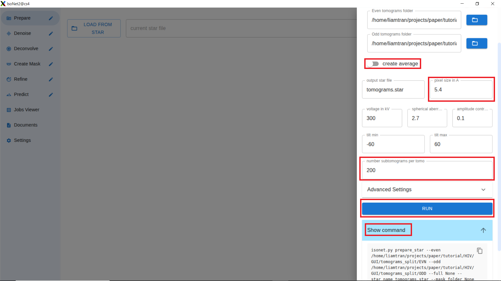
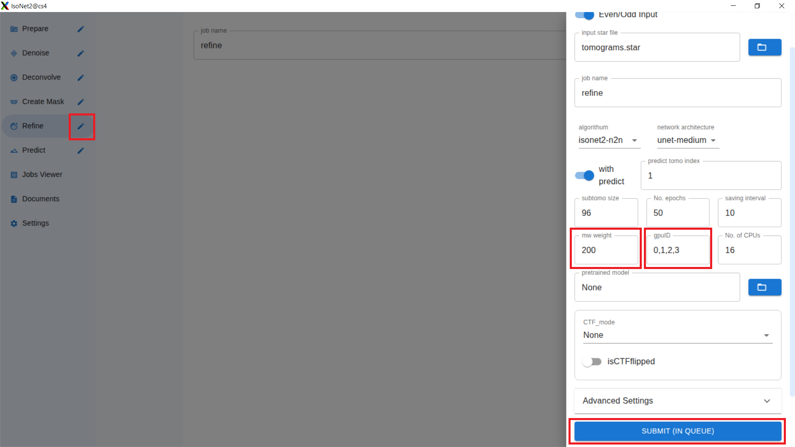
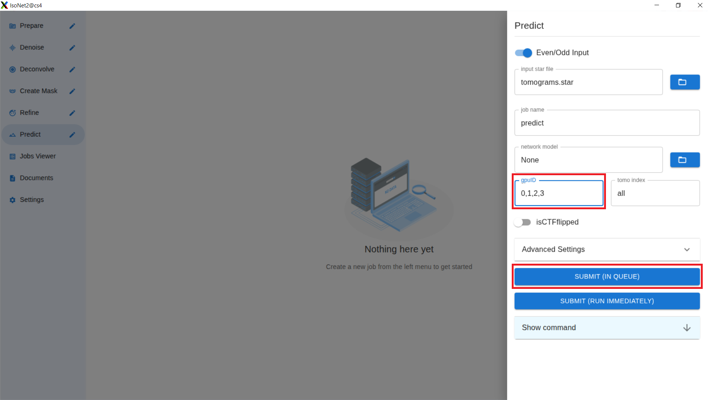
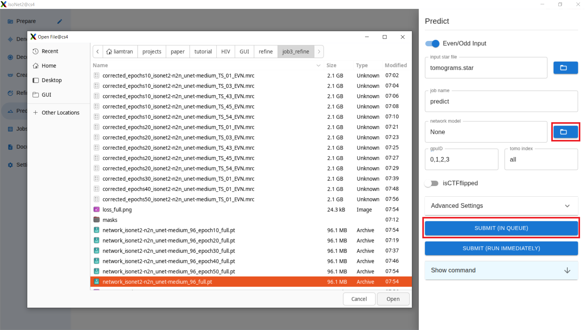
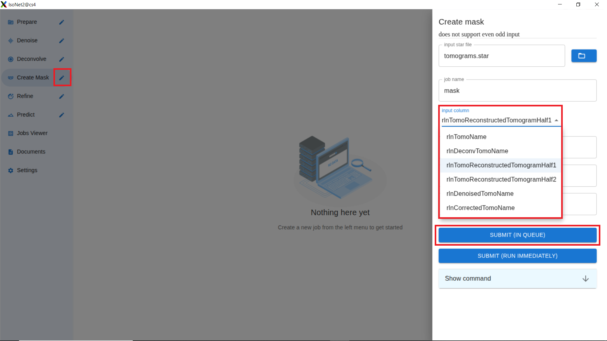
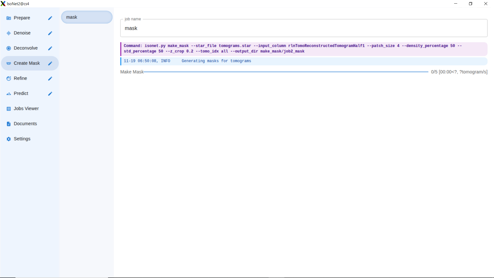
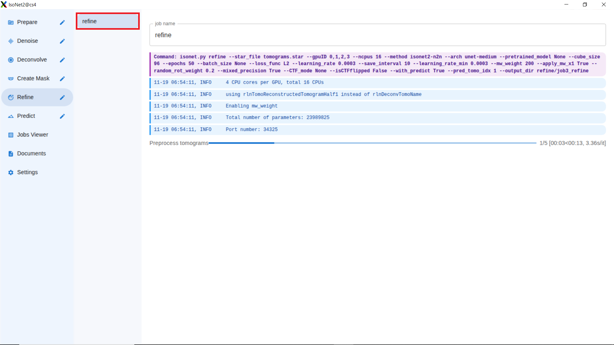
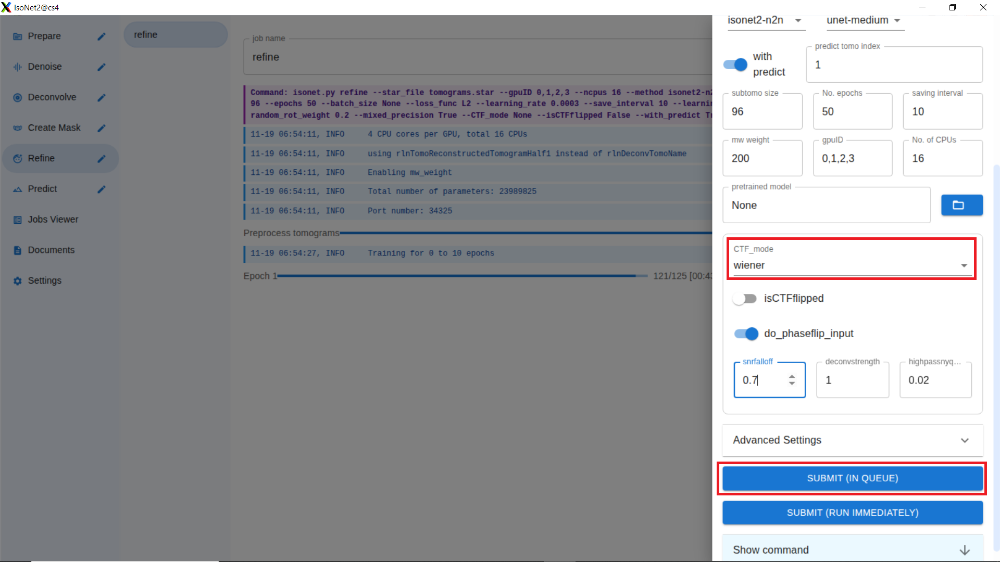
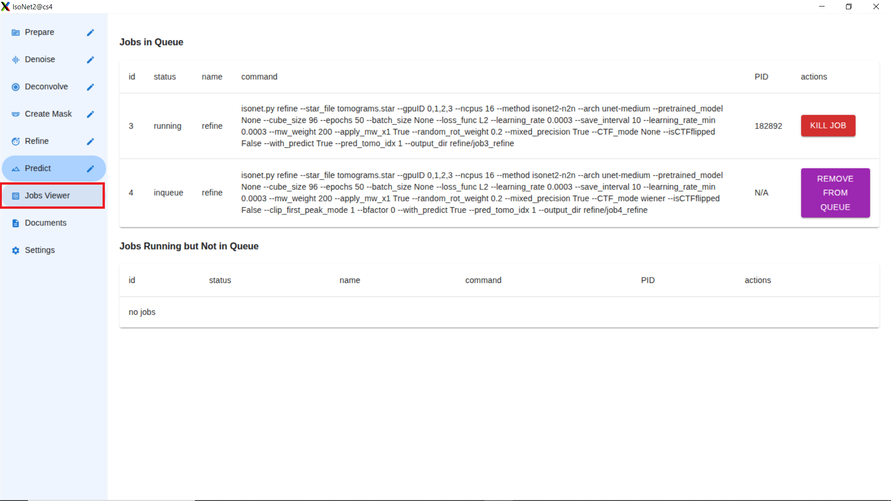

# IsoNet2 Tutorial

**IsoNet2** is a deep-learning software package for simultaneous missing wedge correction, denoising, and CTF correction in cryo-electron tomography reconstructions using a deep neural network trained on information from the original tomogram(s). Compared to IsoNet1, IsoNet2 produces tomograms with higher resolution and less noise in roughly a tenth of the time. The software requires full tomograms or even/odd split tomograms as input. Paired tomograms for Noise2Noise training can be split by either frame or tilt.

**IsoNet2** contains six modules: **prepare star**, **CTF deconvolve**, **generate mask**, **denoise**, **refine**, and **predict**. All commands in IsoNet operate on **.star** text files which record paths of data and relevant parameters. For detailed descriptions of each module please refer to the individual tasks. Users can choose to utilize IsoNet through either GUI or command-lines.

# 1. Installation and System Requirements
The following tutorial is written for assuming absolutely no experience with Anaconda or Linux environments.

Software Requirements: This Linux installation of IsoNet requires CUDA Version >= 11.8 and Conda.

Hardware Requirements: Nvidia GTX 1080Ti or newer, with at least 10 GB VRAM


## Installing [Conda](https://docs.conda.io/projects/conda/en/latest/user-guide/getting-started.html)
+ Download the installer:

  + [Miniconda](https://www.anaconda.com/docs/getting-started/miniconda/main) installer for Linux.

  + [Anaconda Distribution](https://www.anaconda.com/download) installer for Linux.

  + [Miniforge](https://conda-forge.org/download/) installer for Linux.

+ Verify your installer [hashes](https://docs.conda.io/projects/conda/en/latest/user-guide/install/index.html#hash-verification).

+ In your terminal window, run `bash <conda-installer-name>-latest-Linux-x86_64.sh`

  `conda-installer-name` will be one of "Miniconda3", "Anaconda", or "Miniforge3".

+ Follow the prompts on the installer screens. If you are unsure about any setting, accept the defaults. You can change them later.

+ Close and then re-open your terminal window.

+ After successful installation, running the command conda list should display a list of installed packages.

## Installing [CUDA](https://docs.nvidia.com/cuda/cuda-installation-guide-linux/index.html)
+ Find information on your GPU for [Linux](https://itsfoss.com/check-graphics-card-linux/).

+ Look up your GPU to make sure it is supported. If its [CUDA GPU Compute Capability](https://developer.nvidia.com/cuda-gpus) is below ***3.5***, you will not be able to run IsoNet2.

+ Reference your Toolkit Driver Version in Table 3 on the [CUDA Toolkit Docs.](https://docs.nvidia.com/cuda/cuda-toolkit-release-notes/index.html#cuda-major-component-versions__table-cuda-toolkit-driver-versions) to see that it has a corresponding `CUDA Version >= 11.8 (Toolkit Driver Version >=520.61.05)`.

+ Make sure you have installed the appropriate graphics card driver version for your GPU from the [NVIDIA driver page](https://www.nvidia.com/en-us/drivers/).

+ Select the [CUDA Toolkit](https://developer.nvidia.com/cuda-toolkit-archive) version that matches what you read in Table 3 and follow the install instructions.

After successfully installing, you can check your `CUDA` version using `nvidia-smi`, which should produce something similar to below:
```
+---------------------------------------------------------------------------------------+
| NVIDIA-SMI 535.129.03             Driver Version: 535.129.03   CUDA Version: 12.2     |
|-----------------------------------------+----------------------+----------------------+
| GPU  Name                 Persistence-M | Bus-Id        Disp.A | Volatile Uncorr. ECC |
| Fan  Temp   Perf          Pwr:Usage/Cap |         Memory-Usage | GPU-Util  Compute M. |
|                                         |                      |               MIG M. |
|=========================================+======================+======================|
|   0  NVIDIA A100 80GB PCIe          Off | 00000000:01:00.0 Off |                    0 |
| N/A   34C    P0              41W / 300W |     18MiB / 81920MiB |      0%      Default |
|                                         |                      |             Disabled |
+-----------------------------------------+----------------------+----------------------+
|   1  NVIDIA A100 80GB PCIe          Off | 00000000:25:00.0 Off |                    0 |
| N/A   36C    P0              46W / 300W |     18MiB / 81920MiB |      0%      Default |
|                                         |                      |             Disabled |
+-----------------------------------------+----------------------+----------------------+
|   2  NVIDIA A100 80GB PCIe          Off | 00000000:81:00.0 Off |                    0 |
| N/A   35C    P0              46W / 300W |     18MiB / 81920MiB |      0%      Default |
|                                         |                      |             Disabled |
+-----------------------------------------+----------------------+----------------------+
|   3  NVIDIA A100 80GB PCIe          Off | 00000000:C1:00.0 Off |                    0 |
| N/A   37C    P0              46W / 300W |     18MiB / 81920MiB |      0%      Default |
|                                         |                      |             Disabled |
+-----------------------------------------+----------------------+----------------------+

+---------------------------------------------------------------------------------------+
| Processes:                                                                            |
|  GPU   GI   CI        PID   Type   Process name                            GPU Memory |
|        ID   ID                                                             Usage      |
|=======================================================================================|
|    0   N/A  N/A      3610      G   /usr/lib/xorg/Xorg                            4MiB |
|    1   N/A  N/A      3610      G   /usr/lib/xorg/Xorg                            4MiB |
|    2   N/A  N/A      3610      G   /usr/lib/xorg/Xorg                            4MiB |
|    3   N/A  N/A      3610      G   /usr/lib/xorg/Xorg                            4MiB |
+---------------------------------------------------------------------------------------+

```
## Installing IsoNet2

### GUI Installation
Download the IsoNet2 release from the release tab on the right column of our [Github](https://github.com/procyontao/IsoNet2) repository. This release contains the binary file for the GUI. Extract the compressed file into your desired installation folder. 

### non-GUI Installation
Alternatively, if you only plan to use command-line, you can clone this repository by running `git clone https://github.com/procyontao/IsoNet2.git` in your desired installation folder. This will not contain the compiled GUI file. 

Once you have installed IsoNet2, navigate to your installation folder and run `cd IsoNet2` and `bash install.sh`. This creates an Conda environment (installing requirements) using the included **isonet2_environment.yml** file and updates your environment variables (allowing you to call isonet.py) by running `source isonet2.bashrc`. You may append this command to your .bashrc file so you don't have to re-source it every time you wish to use IsoNet.


Installation should take 5-10 minutes. Upon successful installation, running the command `isonet.py --help` should display the following help message.
```
INFO: Showing help with the command 'isonet.py -- --help'.

NAME
    isonet.py - ISONET: Train on tomograms to simultaneously perform missing wedge correction, CTF correction, and denoising.

...
```
# 2. Tutorial

The following tutorial outlines the IsoNet2 GUI and CLI workflow using [5 immature HIV-1 dMACANC VLP tomograms](https://drive.google.com/drive/folders/1JQb5YBr83JM9FWFrxfe0mP8fTgXKJU00?usp=sharing) from EMPIAR-10164 with frame-based EVN/ODD split. The GUI tutorial includes basic explanations of common relevant parameters.

More in-depth explanations for every single parameter can be found under ***3. IsoNet Modules.*** A video tutorial can be found in the following [Google Drive.](https://drive.google.com/drive/u/1/folders/1P9sxSSJIWPs7hIGey3I38u3B2OvmiCAC)


## 2.0 Download Tomograms

In a new working directory, download the **tomograms_split** folder from the link above.

Output for `ls -1 tomograms_split/EVN`:
```
TS_01_EVN.mrc
TS_03_EVN.mrc
TS_43_EVN.mrc
TS_45_EVN.mrc
TS_54_EVN.mrc
```
Output for `ls -1 tomograms_split/ODD`:
```
TS_01_ODD.mrc
TS_03_ODD.mrc
TS_43_ODD.mrc
TS_45_ODD.mrc
TS_54_ODD.mrc
```

 UPDATE TO SHOW FOURIER SPACE

## 2.1 GUI

The *IsoNet2* GUI provides intuitive, detailed, and organized process management, streamlining the fine-tuning of parameters for tomogram refinement. The interface provides tools for dataset organization, parameter configuration, job submission, and real-time process monitoring. Entry points for the main processing steps are kept in a left-hand menu, while the central panel shows the program’s live output during a run, allowing users to view refinement in real time and make adjustments as needed.

### 2.1.0 Launch GUI

Launch the GUI by entering `IsoNet2` into your terminal. For some machines without graphics systems installed, you may receive an error saying that you cannot use the SUID sandbox. Run `IsoNet2 -no-sandbox` instead.

Once the GUI is open, Open the ***Settings*** Tab and select your **conda environment** and **IsoNet Install Path**

### 2.1.1 Prepare Star

Open the ***Prepare*** tab and select **Even/Odd Input**:


Identify your **even** and **odd** data directories. 


By default, **pixel size in Å** and **number subtomograms per tomo** are empty. These can be determined automatically from the total number and metadata of your tomograms. Our HIV data does not contain metadata for pixel size, so we will set it at 5.4.

The other parameters are related to your physical electron microscope and are used later for CTF correction and missing wedge correction. The default values are sufficient for this tutorial. 

You may optionally enable **create_average** to average the half tomograms, reducing noise for the ***Deconvolve*** and ***Create Mask*** modules (more information in 2.1.2).

**Show command** provides the `isonet.py` command if you prefer to run it directly in your terminal.



**Run** your job. The starfile should automatically display. If you ran the command in your terminal, or if you have a pre-existing RELION5 starfile, select **Load from Star** to choose the starfile from your working directory. Adjust the **rlnDefocus** column with the approximate defocus in Å at 0° for each tomogram.


### 2.1.2 Pre-Mask Processing

The following steps increase contrast to improve mask generation.

### 2.1.2.1a Denoise (Recommended)

Open the **Denoise** tab. Keep **Even/Odd Input** enabled and adjust **mw weight** and **gpuID** as needed. **mw weight** determines how heavily the network prioritizes missing wedge correction over denoising. Here the ratio is 200:1. **subtomo_size** should always be a multiple of 16 and must be at least 64. Here, the default is sufficient, but you may increase it for better performance at the cost of memory.



 Click **Submit (In Queue)** for this job. Clicking on your job in the new drawer will display your progress. If **with_preview** is enabled, a network prediction is displayed every save interval so you can observe the training progress. The log output is saved to **./refine/jobID/log.txt**. A graphical representation of the loss is saved to **./refine/jobID_refine/loss_full.png**

### 2.1.2.1b Predict for Denoise

After training is complete, open the **Predict** tab. Adjust **gpuID** as needed. Specifying a tomo index will limit prediction to the corresponding tomograms. We will leave it as 'all' here.



Select the completed model file `network_isonet2-n2n_unet-medium_96_full.pt` from your **./refine/jobID_refine** directory. **Submit** your job. Clicking on your job in the new drawer will display your progress. This output is saved to **./predict/jobID/log.txt**.



Wait for prediction to finish. View your corrected tomograms in **./predict/jobID_predict**.

 DENOISE PREDICTION WITH FOURIER SPACE

### 2.1.2.2 CTF deconvolution (Optional)
If you are unable to use the network-based CTF correction in the denoise module, you may instead use CTF deconvolution to improve mask quality. This quick mask generation workflow is inherited from IsoNet1, but may produce lower quality masks.

ADD DECONVOLUTION WITH FOURIER SPACE

### 2.1.3 Create Mask
This step creates masks using standard deviation and mean density to exclude empty/unwanted areas of each tomogram. During extraction, each subtomogram for training is centered on a valid region of the mask to ensure that it captures a region of interest.

Open the **Create Mask** tab and select your **Input Column**. For even/odd split datasets, choose: 
1) **rlnDenoisedTomoName** if you used the ***Denoise*** module.
2) **rlnDeconvTomoName** if you used the ***Deconvolve*** module.
3) **rlnCorrectedTomoName** if you are refining a previously refined dataset.
4) **rlnTomoName** if you used create_average without using the ***Denoise*** or ***Deconvolve*** modules (not recommended).




**Submit** your job. Clicking on your job in the new drawer will display your progress. This output is saved to **./make_mask/jobID/log.txt**.



### 2.1.4 Refine

Open the **Refine** tab. Keep **Even/Odd Input** enabled and adjust **mw weight** and **gpuID** as needed. **mw weight** determines how heavily the network prioritizes missing wedge correction over denoising. Here the ratio is 200:1. **subtomo_size** should always be a multiple of 16 and must be at least 64. Here, the default is sufficient, but you may increase it for better performance at the cost of memory.


 Click **Submit (In Queue)** for this job. Clicking on your job in the new drawer will display your progress. If **with_preview** is enabled, a network prediction is displayed every save interval so you can observe the training progress. The log output is saved to **./refine/jobID/log.txt**. A graphical representation of the loss is saved to **./refine/jobID_refine/loss_full.png**



To practice queuing jobs, open the **Refine** tab again, using the same parameters as before. Scroll down and select an arbitrary **CTF_mode** to differentiate it from the first job. Click **Submit (In Queue)** to queue your job. You will see a second marker appear in the refine drawer. 
> Clicking **Submit (Run Immediately)** will bypass the queue, causing both jobs to run simultaneously. This will increase training time for both jobs.



Open the **Jobs Viewer** tab. Here we can see the our jobs' statuses and IDs. You can remove the second job.



### 2.1.5 Predict for Refine

After training is complete, open the **Predict** tab. Adjust **gpuID** as needed. Specifying a tomo index will limit prediction to the corresponding tomograms. We will leave it as 'all' here.


Select the completed model file `network_isonet2-n2n_unet-medium_96_full.pt` from your **./refine/jobID_refine** directory. **Submit** your job. Clicking on your job in the new drawer will display your progress. This output is saved to **./predict/jobID/log.txt**.


Wait for prediction to finish. View your corrected tomograms in **./predict/jobID_predict**.


## 2.2 Command Line

The IsoNet2 CLI requires more hands-on data management and familiarity with parameters, but may be more suitable for rapid preliminary fine-tuning of different hyper parameters.

### 2.2.1 Prepare Star
Prepare the starfile. You may enter a single defocus value to be used for every tomogram or a list of values to be applied to their respective tomograms. You may also use your default text editor or the GUI to open **tomograms.star** and manually enter the defocus values.
```
isonet.py prepare_star --even tomograms_split/EVN --odd tomograms_split/ODD --star_name tomograms.star --pixel_size 5.4 --defocus "[39057,14817,25241,29776,15463]"
```

Output for `cat tomograms.star`:

```
# Created by the starfile Python package (version 0.5.6) at 13:43:23 on 17/11/2025


data_

loop_
_rlnIndex #1

...

5       None    tomograms_split/EVN/TS_54_EVN.mrc       tomograms_split/ODD/TS_54_ODD.mrc       5.400000     15463   300     2.700000        0.100000        None    None    -60     60      None    200 None

```
### 2.2.2a denoise (optional)

### 2.2.2b deconv (optional)

### 2.2.3 make_mask

### 2.2.4 Refine

Train IsoNet to reconstruct missing wedge and denoise subtomograms. **with_mask** automatically generates the masks for each tomogram before refinement. **mw_weight** determines how heavily the network prioritizes missing wedge correction over denoising. Here the ratio is 200:1. We recommend directing the output to a logfile so you can review the loss values, but this can also be done graphically by viewing **./isonet_maps/loss_full.png**.

```
isonet.py refine tomograms.star --with_mask True --gpuID <ids> --mw_weight 200 > refine_log.txt
```

### 2.2.5 Predict

After training, apply the trained model to the original tomograms to recover missing wedge regions:

```
isonet.py predict tomograms.star isonet_maps/network_isonet2-n2n_unet-medium_96_full.pt --gpuID <ids>
```

# 3. IsoNet Modules

## prepare_star
Generate a tomograms.star file in the same style as the RELION5 tomographic processing pipeline that lists tomogram file paths and acquisition metadata used by all downstream IsoNet commands. The function accepts either a single set of full tomograms or paired even/odd half tomograms for noise2noise workflows.

### Key parameters

+ full — Directory with full tomogram files; use for single-map training (isonet2).

+ even — Directory with even-half tomograms; use with odd for noise2noise (isonet2-n2n).

+ odd — Directory with odd-half tomograms; use with even for noise2noise (isonet2-n2n).

+ create_average — Creates full tomograms by summing the provided even and odd folders; useful for reducing noise for ***deconv*** and ***make_mask***.

+ number_subtomos — Number of subtomograms to extract per tomogram (written to rlnNumberSubtomo). For IsoNet2, increasing this is analogous to increasing training exposure and can improve results at the cost of runtime and memory.

+ pixel_size — Pixel size in Å. By default, this is read from tomogram metadata. Override this if there is no metadata or if you have a different value.

+ cs, voltage, ac, rlnDefocus — Microscope parameters (spherical aberration mm, acceleration voltage kV, amplitude contrast, defocus in the STAR default units) used for CTF and missing wedge correction. Override if different from defaults.

+ tilt_min — Minimum tilt angle in degrees; default **-60**. Override if your tilt range is different.

+ tilt_max — Maximum tilt angle in degrees; default **60**. Override if your tilt range is different.

+ mask_folder — Optional directory with masks; entries are recorded in rlnMaskName.

+ coordinate_folder — Optional directory with subtomogram coordinate files; if provided, the number of subtomograms is taken from the coordinate files and overrides number_subtomos.

+ star_name — Name of starfile.


### Practical notes
> Use even and odd when you plan to use noise2noise training; use full for single-map training.
If tilt range differs from ±60°, supply tilt_min and tilt_max so the code records the correct missing-wedge geometry.
Inspect and edit the generated STAR if you need tomogram-specific subtomogram counts or have pregenerated mask/defocus entries.

## denoise
Entry point for IsoNet2 training. Use denoise for quicker noise-to-noise (n2n) training workflows for preliminary tomogram testing and mask generation.

### Key parameters

+ arch — Network architecture string (e.g., unet-small, unet-medium, unet-large). Determines model capacity and VRAM requirements.

+ batch_size — Number of subtomograms per optimization step; if None, this is automatically determined by multiplying the number of available GPUs by 2. If the number of GPUs is 1, batch size is 4. Batch size per GPU matters for gradient stability.

+ bfactor — B-factor applied during training/prediction to boost high-frequency content. For cellular tomograms we recommend a b-factor of 0. For isolated sample, you can use a bfactor from 200-300.

+ CTF_mode — CTF handling mode: "None", "phase_only", "wiener", or "network".
  + "None": No CTF correction
  + "phase_only": Phase-only correction
  + "network": Applies CTF-shaped filter to network input
  + "wiener": Applies Wiener filter to network target
            
+ cube_size — Size in voxels of training subvolumes (default **96**). Must be compatible with the network (divisible by the network downsampling factors).

+ do_phaseflip_input — Whether to apply phase flip during training.
            
+ epochs — Number of training epochs.

+ gpuID — GPU IDs to use during training (e.g., "0,1,2,3").

+ isCTFflipped — Whether input tomograms are phase flipped.

+ loss_func — Loss function to use (L2, Huber, L1).

+ learning_rate — Initial learning rate.

+ learning_rate_min — Minimum learning rate for scheduler.

+ mixed_precision — If True, uses float16/mixed precision to reduce VRAM and speed up training.

+ ncpus — Number of CPUs to use for data processing.

+ output_dir — Directory to save trained model and results.

+ prev_tomo_idx — If set, automatically predict only the tomograms listed by these indices (e.g., "1,2,4" or "5-10,15,16").

+ pretrained_model — Path to pretrained model to continue training. Previous method, arch, cube_size, CTF_mode, and metrics will be loaded.

+ save_interval — Interval to save model checkpoints. Default is epochs/10.

+ star_file — Star file for tomograms.

+ with_preview — If True, run prediction using the final checkpoint(s) after training.
            
+ snrfalloff, deconvstrength, highpassnyquist — parameters for CTF deconvolution 
  + forwarded to deconvolution for `--with_deconv True`
  + used to calculate Wiener filter for network-based deconvolution


### Practical notes
> Choose arch, cube_size, and batch_size to fit your GPU memory; larger architectures and cubes improve fidelity but increase resource needs.
Enable mixed_precision to save VRAM and speed up training if your GPU and drivers support it.


## deconv
CTF deconvolution preprocessing that enhances low-resolution contrast and recovers information attenuated by the microscope contrast transfer function. Recommended for non–phase-plate data; skip for phase-plate data or if intending to use network-based CTF deconvolution.

### Key parameters
+ star_file — Input STAR listing tomograms and acquisition metadata.

+ output_dir — Folder to write deconvolved tomograms (rlnDeconvTomoName entries point here).

+ input_column — STAR column used for input tomogram paths (default **rlnTomoName**).

+ snrfalloff — Controls frequency-dependent SNR attenuation applied during deconvolution; default **1.0**. Larger values reduce high-frequency contribution more aggressively and can stabilize deconvolution on noisy data; smaller values preserve more high-frequency content but risk amplifying noise.

+ deconvstrength — Scalar multiplier for deconvolution strength; default **1.0**. Increasing this emphasizes correction and low-frequency recovery but can introduce ringing/artifacts if set too high.

+ highpassnyquist — Fraction of the Nyquist used as a very-low-frequency high-pass cutoff; default **0.02**. Use to remove large-scale intensity gradients and drift; usually left at default.

+ chunk_size — If set, tomograms are processed in smaller cubic chunks to reduce memory usage. Useful for very large tomograms or limited RAM/VRAM. May create edge artifacts if chunks are too small.

+ overlap_rate — Fractional overlap between adjacent chunks when chunking (default **0.25**). Larger overlaps reduce edge artifacts at cost of extra computation.

+ ncpus — Number of CPU workers for CPU-bound parts of deconvolution; increase on multi-core systems.

+ phaseflipped — If True, input is assumed already phase-flipped; otherwise the function uses defocus and CTF info to apply phase handling.

+ tomo_idx: If set, process only the tomograms listed by these indices (e.g., "1,2,4" or "5-10,15,16").

INSERT COMPARISONS FOR SNRFALLOFF

INSERT COMPARISONS FOR DECONVSTRENGTH


### Practical notes
> Inspect deconvolved outputs visually for ringing or other artifacts after changing snrfalloff or deconvstrength.
Use chunking plus a moderate overlap_rate (0.25–0.5) when memory is limited.

## make_mask
Generate masks to prioritize regions of interest. Masks improve sampling efficiency and training stability.

### Key parameters
+ star_file — Input STAR listing tomograms and acquisition metadata.

+ input_column — STAR column to read tomograms from (default **rlnDeconvTomoName**; falls back to **rlnTomoName** or **rlnTomoReconstructedTomogramHalf1** if absent).

+ output_dir — Folder to save mask MRCs; rlnMaskName is updated in the STAR.

+ patch_size — Local patch size used for max/std local filters (default **4**). Larger values smooth detection of specimen regions; default works for typical pixel sizes.

+ density_percentage — Percentage of voxels retained based on local density ranking (default **50**). Lower values create stricter masks (keep fewer voxels).

+ std_percentage — Percentage retained based on local standard-deviation ranking (default **50**). Lower values emphasize textured regions.

+ z_crop — Fraction of tomogram Z to crop from both ends (default **0.2** masks out top and bottom 10% each). Use to avoid sampling low-quality reconstruction edges.

+ tomo_idx — If set, process only the tomograms listed by these indices (e.g., "1,2,4" or "5-10,15,16").

INSERT PICTURE OF MASK ON CORRECTED (2.1) TOMOGRAM

### Practical notes
> Defaults are suitable for most datasets; tune density/std percentages for very sparse specimens or dense, crowded volumes.
If automatic masks miss specimen regions, edit boundaries in the STAR or provide manual masks.


## refine
Use refine for IsoNet2 missing-wedge correction (IsoNet2) or IsoNet2-n2n combined modes. 

### Key parameters

+ noise_level  — Adds artificial noise during training.

+ noise_mode  — Controls filter applied when generating synthetic noise (None, ramp, hamming).

+ apply_mw_x1  — Whether to apply missing wedge to subtomograms at the beginning.

+ clip_first_peak_mode  — Controls attenuation of overrepresented very-low-frequency CTF peak. Options 2 and 3 might increase low resolution contrast: 
  + 0 none
  + 1 constant clip
  + 2 negative sine
  + 3 cosine

+ input_column  — Column name in star file to use as input tomograms.

+ mw_weight  — Weight for missing wedge loss. Higher values correspond to stronger emphasis on missing 
wedge regions. Disabled by default.

+ method  — "isonet2" for single-map missing-wedge correction, "isonet2-n2n" for noise2noise when even/odd halves are present. If omitted, the code auto-detects the method from the STAR columns.

+ num_mask_updates  — Number of times to update masks based on predicted tomograms during training.

+ random_rot_weight  — Percentage of rotations applied as random augmentation.

+ with_deconv  — Whether to deconvolve automatically.

+ with_mask  — Whether to generate masks automatically.

+ arch — Network architecture string (e.g., unet-small, unet-medium, unet-large, scunet-fast). Determines model capacity and VRAM requirements.

+ batch_size — Number of subtomograms per optimization step; if None, this is automatically determined by multiplying the number of available GPUs by 2. If the number of GPUs is 1, batch size is 4. Batch size per GPU matters for gradient stability.

+ bfactor — B-factor applied during training/prediction to boost high-frequency content. For celluar tomograms we recommend to make b-factor to be 0. If it is for isolated sample, you can make the bfactor to be 200-300.

+ CTF_mode — CTF handling mode: "None", "phase_only", "wiener", or "network".
  + "None": No CTF correction
  + "phase_only": Phase-only correction
  + "network": Applies CTF-shaped filter to network input
  + "wiener": Applies Wiener filter to network target
            
+ cube_size — Size in voxels of training subvolumes (default **96**). Must be compatible with the network (divisible by the network downsampling factors).

+ do_phaseflip_input — Whether to apply phase flip during training.
            
+ epochs — Number of training epochs.

+ gpuID — GPU IDs to use during training (e.g., "0,1,2,3").

+ isCTFflipped — Whether input tomograms are phase flipped.

+ loss_func — Loss function to use (L2, Huber, L1).

+ learning_rate — Initial learning rate.

+ learning_rate_min — Minimum learning rate for scheduler.

+ mixed_precision — If True, uses float16/mixed precision to reduce VRAM and speed up training.

+ ncpus — Number of CPUs to use for data processing.

+ output_dir — Directory to save trained model and results.

+ prev_tomo_idx — If set, automatically predict only the tomograms listed by these indices (e.g., "1,2,4" or "5-10,15,16").

+ pretrained_model — Path to pretrained model to continue training. Previous method, arch, cube_size, CTF_mode, and metrics will be loaded.

+ save_interval — Interval to save model checkpoints. Default is epochs/10.

+ star_file — Input STAR listing tomograms and acquisition metadata.

+ with_preview — If True, run prediction using the final checkpoint(s) after training.
            
+ snrfalloff, deconvstrength, highpassnyquist — parameters for CTF deconvolution 
  + forwarded to deconvolution for `--with_deconv True`
  + used to calculate Wiener filter for network-based deconvolution

INSERT B FACTOR FIGURE (EXTENDED DATA FIG 2)


### Practical notes
> Choose arch, cube_size, and batch_size to fit your GPU memory; larger architectures and cubes improve fidelity but increase resource needs.
Enable mixed_precision to save VRAM and speed up training if your GPU and drivers support it.

## predict

Apply a trained IsoNet model to tomograms to produce denoised or missing-wedge–corrected volumes. Prediction utilizes the model's saved cube size and CTF handling options, but allows for runtime adjustments.

### Key parameters
+ star_file — Input STAR describing tomograms to predict.

+ model — Path to trained model checkpoint (.pt) for single-model prediction.

+ output_dir — Folder to save predicted tomograms; outputs are recorded in the STAR as 
rlnCorrectedTomoName or rlnDenoisedTomoName depending on method.

+ gpuID — GPU IDs string (e.g., "0" or "0,1"); use multiple GPUs when available for speed.

+ input_column — STAR column used for input tomogram paths (default **rlnDeconvTomoName**).

+ apply_mw_x1 — If True (default), build and apply the missing-wedge mask to cubic inputs before prediction.

+ isCTFflipped — Declare if input tomograms are already phase-flipped; affects CTF handling.

+ padding_factor — Cubic padding factor used during tiling to reduce edge effects (default **1.5**); larger padding reduces seams but increases computation.

+ tomo_idx — Process a subset of STAR entries by index.

+ output_prefix — Prefix to append to predicted MRC files.

### Practical notes
> Match prediction cube/crop sizes and padding to the network’s training settings (these come from the model object).
When using CTF-aware models, ensure isCTFflipped and STAR defocus/CTF fields are correct.

# 4. FAQs
## Q: When should I use even/odd split versus full tomograms?
Use even/odd split tomograms when you want to perform Noise2Noise (n2n) training, which is generally recommended as it provides better denoising. Use full tomograms for single-map training (isonet2 method) when movies and tilt-series are not available.
## Q: How many subtomograms should I extract per tomogram/epochs should I train for?
The default is 3000 subtomograms in total per epoch. Changing this default is not usually necessary unless you would like to increase the number of subtomograms for a particularly dense tomogram. Reducing this number is not recommended.

Increasing the number of subtomograms is analogous to increasing the number of training epochs, as subtomograms are extracted during training (as opposed to before, in IsoNet1). Because IsoNet2 does not currently use a specialized learning rate scheduler, it is okay to keep the default and simply halt training when the loss has converged. We also do not recommend training for less than 50 epochs.
## Q: How can I reduce memory usage during training?
+ Enable mixed_precision for float16 training
+ Reduce batch_size (minimum being the number of GPUs you have)
+ Choose a smaller network architecture
+ Reduce cube_size
+ Use chunk_size with overlap_rate for processing large tomograms
## Q: When should I use the CTF deconvolution module?
First case is you want to use full tomograms instead of even/odd tomograms for  missing wedge correction as IsoNet1.
Second case is if you have even/odd tomograms and want to quickly generate a mask for refinement. You can enable create average in prepare star to create averaged tomograms and use deconvolution to create deconvolved tomogram as a base for masking. 
## Q: When should I create masks?
Masks prioritize regions of interest (specimen areas) during training, which improves sampling efficiency and training stability by focusing the network on relevant areas rather than empty space. **We recommend always creating a mask for refinement.** They are not necessary for ***denoise.***
## Q: My masks are missing specimen regions. What can I do?
A: You can regenerate the mask using less strict (higher values) density_percentage and std_percentage parameters, manually edit the mask boundaries in the .star file, or provide your own manual masks through the mask_folder parameter.
## Q: Which CTF Mode should I use (Network or Wiener) during refine? 
A: Network using clip_first_peak_mode 1 in general provides higher resolution detail. Modes 2, 3 and 0 will sometimes have higher contrast in the low resolution regime. Try it out! Weiner filter also works the SNR flloff is better to be 0 to 1 in this case and wht deconv strengrh can be 1 to 5. However weiener need mode hyper parrameter adjustment thane the network-based CTf correction. These all should be better than doing ctf deconvolution deperately interms of correcting CTF. 
## Q: What value should I use for mw weight?
A: Our testing has determined that missing wedge weights from 20 to 200 are ideal, heavily weighting missing wedge correction.

B the mask loss is not used, and a singfle loss is to describe the missign wedge correction and also the denoising. We like to put a higher weight for missign wedge correction actually in this case we can use  mask lodd that can put weight on the missnign wedge corredction. We try this value to be goos if t o be set to 20 to 200, meaning putting a lot more weight on msigg wedge correction. 